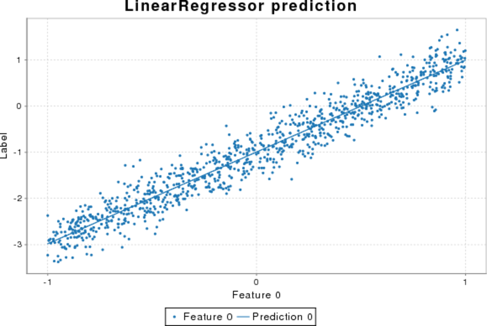

# MLlab

[](https://travis-ci.org/andb0t)

This is an experimental platform-independent machine learning library. Born from the desire to implement modern machine learning algorithms by hand, this project has grown considerably and provides now basic algorithms for various classification and regression tasks.


#### Content
* [Implemented algorithms](#implemented-algorithms)
  * [Classification](#classification)
  * [Regression](#regression)
  * [Misc](#misc)
* [Examples of usage](#examples-of-usage)
  * [Classification](#classification)
    * [Logistic regression](#logistic-regression)
  * [Regression](#regression)
    * [Linear regression](#linear-regression)
* [Algorithm details](#algorithm-details)


## Implemented algorithms
Please consult the [API](https://andb0t.github.io/MLlab/api/index.html) for detailed and up-to-date information on the algorithms, e.g. the implemented hyper parameters.

### Classification
- [x] random
- [x] k-nearest neighbors
- [x] decision tree
- [x] perceptron
- [x] multilayer neural network
- [x] logistic regression
- [ ] SVM with linear and non-linear kernel (see [here](http://alex.smola.org/teaching/pune2007/pune_3.pdf) or [here](https://oceandatamining.sciencesconf.org/conference/oceandatamining/program/OBIDAM14_Canu.pdf))
- [ ] naive Bayesian classification

### Regression
- [x] random
- [x] linear regression
- [x] polynomial regression with linear kernel
- [ ] naive Bayesian regression

### Misc
- [x] extension of linear models to polynomial dependencies via feature transformation


## Examples of usage
This section gives some impressions of what the implemented algorithms can perform and how to use the API.


### Classification

The basic usage of classifiers is as follows:

```scala
/**
 * @param X_train List of feature vectors for training
 * @param y_train List of labels
 * @param X_test List of feature vectors for prediction
 */
val clf = new Classifier()  // optional hyperparameters as arguments
clf.train(X_train, y_train)  // perform the training
val y_pred = clf.predict(X_test)  // make a prediction
val diag = clf.diagnostics  // obtain a map of metrics for algorithm training

```

#### Logistic regression
Classification via logistic regression is a standard algorithm for binary linear classification. It optimizes the parameters of a linear hyperplane in the feature space to separate regions of different label classes. For this, the linear transformation of the instance vectors is further transformed with the logistic sigmoid function to obtain probabilities of belonging to a specific class. It can be instantiated as follows:
```scala
val clf = new LogisticRegressionClassifier()
```
The picture below shows the performance of the algorithm applied to a test dataset of a shifted diagonal as class separator.


Using a trick, the internal addition of higher orders of the features, linear algorithms can be applied to non-linear datasets.
```scala
val clf = new LogisticRegressionClassifier(degree=2)
```
This adds powers up until quadratic powers of the feature to the feature vector. Here is an example of the same algorithm applied to circular data. The classifier can now solve the corresponding classification task.


### Regression

The basic usage of regressors is as follows:

```scala
/**
 * @param X_train List of feature vectors for training
 * @param y_train List of labels
 * @param X_test List of feature vectors for prediction
 */
val reg = new Regressor()  // optional hyperparameters as arguments
reg.train(X_train, y_train)  // perform the training
val y_pred = reg.predict(X_test)  // make a prediction
val diag = reg.diagnostics  // obtain a map of metrics for algorithm training

```

#### Linear regression
MLlab provides several algorithms for regression tasks. The most basic is the linear regression. It is designed to fit data with a underlying linear dependencies on an arbitrary dimensional set of features.
```scala
val reg = new LinearRegressor()
```
This is a basic example for the case of a 1D feature vector and a 1D label. The training and testing data have been drawn from a linear function with Gaussian noise.



Using a trick, the internal addition of higher orders of the features, linear algorithms can be applied to non-linear datasets.
```scala
val reg = new LinearRegressor(degree=3)
```
This is an example of the same algorithm applied to data with a cubic dependence, where powers up until cubic powers of the feature have been added to the feature vector.


## Algorithm details

This section explains the implemented algorithms in more depth.
