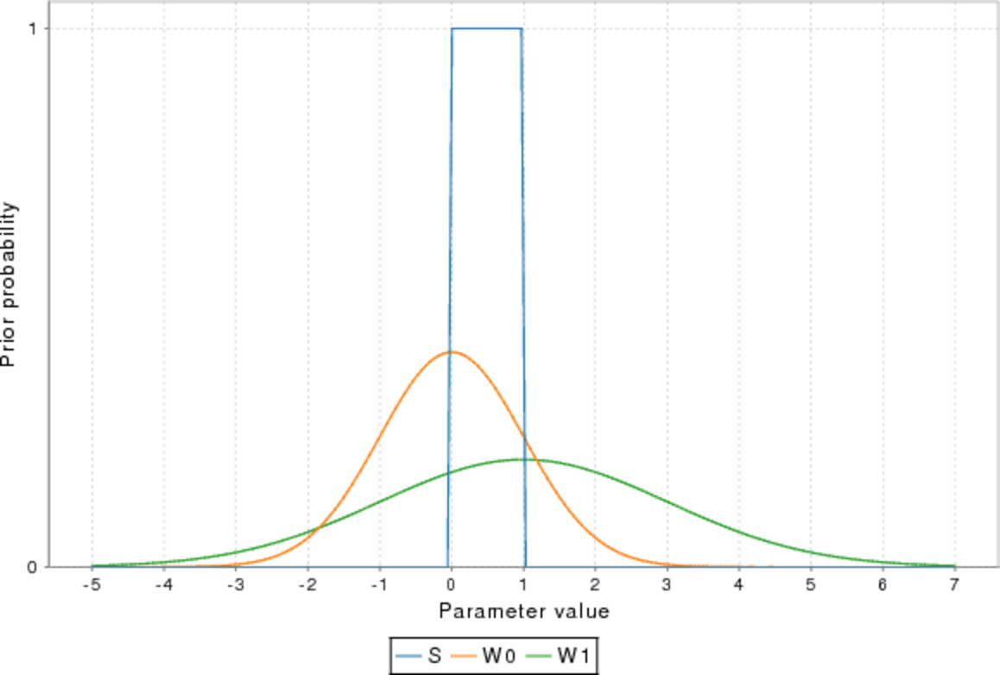

# MLlab

[](https://travis-ci.org/andb0t)

This is an experimental platform-independent machine learning library. Born from the desire to implement modern machine learning algorithms by hand, this project has grown considerably and provides now basic algorithms for various classification and regression tasks.

The library is written in [Scala](https://www.scala-lang.org/) and can therefore make use of the [JVM](https://java.com/), making it platform-independent.


#### Content
* [Implemented algorithms](#implemented-algorithms)
  * [Classification](#classification)
    * [Naive Bayes](#naive-bayes-classification)
    * [Logistic Regression](#logistic-regression-classification)
    * [Perceptron](#perceptron-classification)
    * [k-Nearest Neighbors](#k-nearest-neighbors-classification)
    * [Decision Tree](#decision-tree-classification)
    * [Multilayer Neural Network](#multilayer-neural-network-classification)
  * [Regression](#regression)
    * [Linear](#linear-regression)
    * [Bayes](#bayes-regression)
    * [Decision Tree](#decision-tree-regression)
* [Algorithm details](#algorithm-details)


## Implemented algorithms
This section gives some impressions of the usage and what the implemented algorithms can perform.
Please consult the [API](https://andb0t.github.io/MLlab/api/index.html) for detailed and up-to-date information on the algorithms, e.g. the extensive list of implemented hyper parameters.


### Classification

The basic usage of classifiers is as follows:

```scala
/**
 * @param X_train List of feature vectors for training
 * @param y_train List of labels
 * @param X_test List of feature vectors for prediction
 */
val clf = new Classifier()  // optional hyperparameters as arguments
clf.train(X_train, y_train)  // perform the training
val y_pred = clf.predict(X_test)  // make a prediction
val diag = clf.diagnostics  // obtain a map of metrics for algorithm training

```


#### Naive Bayes Classification
This algorithm bases on the assumption of mutually uncorrelated features. It uses Bayes' theorem to infer probabilities for each instance to belong to each class. The model parameters for the feature likelihoods are inferred from the training feature vectors.

```scala
val clf = new NaiveBayesClassifier()
```

The application of the standard settings to a test dataset of a shifted diagonal as class separator shows a bias. This stems from the fact, that the assumption of Gaussian distributed features for each class is not true for this dataset.


Despite the limits of the naive assumption, the naive Bayes' algorithm provides good results in many cases. It is especially efficient for highly dimensional datasets with little training data, since it treats all feature instances separately.


#### Logistic Regression Classification
Classification via logistic regression is a standard algorithm for binary linear classification. It optimizes the parameters of a linear hyperplane in the feature space to separate regions of different label classes. For this, the linear transformation of the instance vectors is further transformed with the logistic sigmoid function to obtain probabilities of belonging to a specific class. It can be instantiated as follows:

```scala
val clf = new LogisticRegressionClassifier()
```
The picture below shows the performance of the algorithm applied to the diagonal dataset.


Using a trick, the internal addition of higher orders of the features, linear algorithms can be applied to non-linear datasets.

```scala
val clf = new LogisticRegressionClassifier(degree=2)
```
This adds powers up until quadratic powers of the feature to the feature vector. Here is an example of the same algorithm applied to circular data. The classifier can now solve the corresponding classification task.


#### Perceptron Classification
The perceptron algorithm tries to find any linear boundary to perfectly separate the classes. It updates the weights of the linear model sequentially for each training instance in each training step in the direction of correct classification. This is repeated until a chosen precision or maximum of iterations is reached.

```scala
val clf = new PerceptronClassifier()
```


Applying the same feature transformation as above, also this linear algorithm can solve the circular data task.

```scala
val clf = new PerceptronClassifier(degree=2)
```


#### k-Nearest Neighbors Classification
This algorithm determines predicts the label of an instance from the k (e.g. k=3) nearest instances in the training set, according to some specified metric (mostly Euclidian). It can in principle be applied to arbitrary dimensional and complex features, but has limited performance for large training sets and/or number of features.

```scala
val clf = new kNNClassifier()
```
Here is its performance on the circular dataset.


#### Decision Tree Classification
A decision tree is based on a binary tree datastructure and applies a one dimensional cut-off based on one feature at each node. The cut-off threshold and the feature it is applied to are chosen to maximize a purity metric for the resulting split in the training data. The depth of the tree sets the number of binary decisions to be taken.

```scala
val clf = new DecisionTreeClassifier()
```

This is the application of a decision tree algorithm to the circular dataset. In the default configuration the number of decisions is not sufficient to appropriately detecting the circle:


Increasing the tree depth roughly doubles the number of nodes. With this setting, the decision tree is able to classify the test data reasonably well.

```scala
val clf = new DecisionTreeClassifier(depth=4)
```


#### Multilayer Neural Network Classification
The implemented neural networks (NN) are feedforward NNs trained using the backpropagation algorithm. They are very versatile but require extensive tuning and experience for successful application.

```scala
val clf = new NeuralNetworkClassifier()
```

A naive application of the NN with the default settings to the circular dataset fails:


After increasing the number of neurons on the second layer to 16, the NN performs very well.

```scala
val clf = new NeuralNetworkClassifier(layers=List(2, 16, 2))
```


### Regression

The basic usage of regressors is as follows:

```scala
/**
 * @param X_train List of feature vectors for training
 * @param y_train List of labels
 * @param X_test List of feature vectors for prediction
 */
val reg = new Regressor()  // optional hyperparameters as arguments
reg.train(X_train, y_train)  // perform the training
val y_pred = reg.predict(X_test)  // make a prediction
val diag = reg.diagnostics  // obtain a map of metrics for algorithm training

```

#### Linear Regression
MLlab provides several algorithms for regression tasks. The most basic is the linear regression. It is designed to fit data with an underlying linear dependencies on an arbitrary dimensional set of features.

```scala
val reg = new LinearRegressor()
```

This is a basic example for the case of a 1D feature vector and a 1D label. The training and testing data have been drawn from a linear function with Gaussian noise.


Using a trick, the internal addition of higher orders of the features, linear algorithms can be applied to non-linear datasets.

```scala
val reg = new LinearRegressor(degree=3)
```

This is an example of the same algorithm applied to data with a cubic dependence, where powers up until cubic powers of the feature have been added to the feature vector.


#### Bayes Regression
Linear Bayesian regression is the Bayesian counterpart to the linear regression of the frequentist approach. It assumes prior probability density functions for the linear parameters and determines them from the maximum likelihood parameters using the posterior function, given the training data.

```scala
val reg = new BayesRegressor()
```

This is an application to the linear dataset. The assumed prior and posterior probabilities for the linear parameters are shown as well. Given the training data, the probabilities collapse to the expected values.


 

With the same trick of adding higher feature orders, linear Bayesian regression can be applied to datasets with polynomial truth.

```scala
val reg = new BayesRegressor(degree=3)
```


#### Decision Tree Regression
The decision tree regression determines the predicted value associated to a given test instance from the average of the training labels at the corresponding decision node. The decision threshold is determined from the minimum quadratic sum of the label distance. Let's try a decision tree depth of 3 again.

```scala
val reg = new DecisionTreeRegressor(depth=3)
```

This is the application of a decision tree regression algorithm to the cubic dataset. The prediction is quite crude.


Increasing the tree depth increases the number of nodes by about factors of two. With this setting, the decision tree is able to fit the test data reasonably well.

```scala
val reg = new DecisionTreeRegressor(depth=6)
```


## Algorithm details

This section explains the implemented algorithms in more depth. It is currently work in progress!
